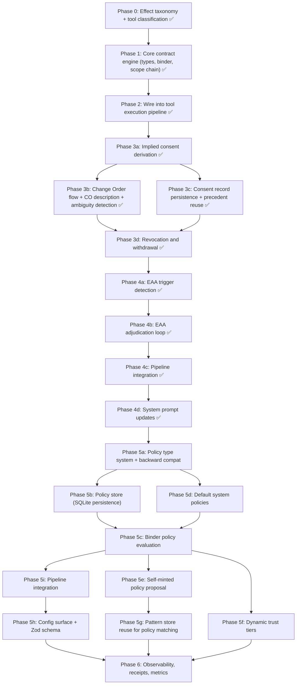

# Consent-Bound Agency via Scope-as-Contract in OpenClaw

## Conceptual Mapping: Paper to OpenClaw

The paper defines five core primitives. Here is how each maps to OpenClaw's existing architecture:

| Paper Concept                      | OpenClaw Existing Surface                                                           | Integration Point                                                                               |
| ---------------------------------- | ----------------------------------------------------------------------------------- | ----------------------------------------------------------------------------------------------- |
| **Purchase Order (PO)**            | Request context (session, sender, channel, message)                                 | Formalize in `src/consent/types.ts`; derived from intake in `pi-embedded-runner/run/attempt.ts` |
| **Work Order (WO)**                | No direct equivalent (tool-policy is static filtering, not per-slice contracts)     | New artifact carried via AsyncLocalStorage (`src/consent/scope-chain.ts`)                       |
| **Change Order (CO)**              | Exec approvals + plugin approvals (`src/gateway/server-methods/plugin-approval.ts`) | Generalize approval manager into consent elicitation                                            |
| **Elevated Action Analysis (EAA)** | Partial: `tools.elevated`, dangerous-tools list, system prompt safety section       | New deliberation module (`src/consent/eaa.ts`)                                                  |
| **Standing Policies**              | Tool profiles, allow/deny lists, owner-only, group policies                         | Extend with bounding-box metadata in `src/consent/policy.ts`                                    |

---

## Phase 0: Effect Class Taxonomy and Tool Classification

Before any runtime enforcement, define the vocabulary of effects and classify every tool.

### 0a. Define the Effect Class Enum

Create `src/consent/types.ts` with the foundational types:

```typescript
export type EffectClass =
  | "read" // read-only data access
  | "compose" // internal content creation (drafts, plans)
  | "persist" // durable state write (memory, files)
  | "disclose" // external communication / third-party disclosure
  | "audience-expand" // adding recipients or broadening reach
  | "irreversible" // deletion, revocation, actions that cannot be undone
  | "exec" // host/system command execution
  | "network" // outbound network requests
  | "elevated" // administrative or privileged operations
  | "physical"; // physical actuation (future: robotics)
```

### 0b. Effect Profiles on Tools

Extend `AnyAgentTool` (`[src/agents/tools/common.ts](src/agents/tools/common.ts)`) with an optional `effectProfile`:

```typescript
export type ToolEffectProfile = {
  effects: EffectClass[];
  trustTier?: "in-process" | "sandboxed" | "external";
  description?: string; // human-legible effect summary
};
```

### 0c. Classify Existing Tools

Build a registry mapping in `src/consent/effect-registry.ts` that maps known tool names to their declared `EffectClass[]`. This is the deterministic lookup table the binder will use:

- `read`, `glob`, `grep`, `ls` --> `["read"]`
- `write`, `apply_patch`, `notebook_edit` --> `["persist"]`
- `exec`, `bash` --> `["exec", "irreversible"]`
- `web_fetch`, `web_search` --> `["network", "read"]`
- `message_send` --> `["disclose"]`
- `memory_*` --> `["persist"]`
- `delete` --> `["irreversible", "persist"]`

Plugin-registered tools declare their own profiles via `registerTool` options.

---

## Phase 1: Core Contract Engine

### 1a. Work Order Type

In `src/consent/types.ts`, define the WO as an immutable, serializable artifact:

```typescript
export type WorkOrder = {
  id: string; // unique WO id (uuid)
  predecessorId?: string; // for WO' chains
  requestContextId: string; // links to PO
  grantedEffects: EffectClass[]; // what this slice may cause
  constraints: WOConstraint[]; // limits (time-bound, audience, etc.)
  stepRef?: string; // tool/skill identity for ceiling check
  consentAnchors: ConsentAnchor[]; // refs to consent records or EAA adjudications
  mintedAt: number; // timestamp
  expiresAt?: number; // TTL
  immutable: true; // marker
};
```

### 1b. Purchase Order (Request Context)

Formalize the request context that already flows through the agent run:

```typescript
export type PurchaseOrder = {
  id: string;
  requestText: string;
  senderId: string;
  senderIsOwner: boolean;
  channel?: string;
  chatType?: string;
  sessionKey?: string;
  agentId?: string;
  impliedEffects: EffectClass[]; // derived from request analysis
  timestamp: number;
};
```

The `impliedEffects` derivation is the key inference step -- see Phase 3.

### 1c. Deterministic Contract Binder

Create `src/consent/binder.ts`. The binder is the sole authority for minting WOs:

- **Inputs**: PO, active policies, consent records, EAA adjudication results, step metadata (tool effect profile)
- **Outputs**: A minted WO with grants that are the intersection of (consented effects) and (step ceiling from effect profile)
- **Rules**:
  - Never accept raw capability strings from inference
  - Verify consent anchors exist and are valid before granting effects
  - Apply system policy prohibitions unconditionally
  - Bound grants to the step's declared effect profile (ceiling check)
  - Apply TTL and constraints

### 1d. Scope Chain (AsyncLocalStorage)

Create `src/consent/scope-chain.ts`, modeled on the existing `gateway-request-scope.ts` pattern:

```typescript
const consentScope = new AsyncLocalStorage<ConsentScopeState>();

export type ConsentScopeState = {
  po: PurchaseOrder;
  activeWO: WorkOrder;
  woChain: WorkOrder[]; // immutable predecessors
  consentRecords: ConsentRecord[];
  eaaRecords: EAARecord[];
};
```

This scope is created at agent run start and carried through tool execution.

---

## Phase 2: Integration with Tool Execution Pipeline

### 2a. WO Minting at Agent Run Start

In `[src/agents/pi-embedded-runner/run/attempt.ts](src/agents/pi-embedded-runner/run/attempt.ts)`, after the PO is derived from the incoming message context, mint an initial WO covering implied-consent effects. The binder uses the tool set and request text to derive the initial grants.

### 2b. Before-Tool-Call WO Verification

In `[src/agents/pi-tools.before-tool-call.ts](src/agents/pi-tools.before-tool-call.ts)`, add a verification step:

1. Look up the tool's `EffectProfile` from the registry
2. Read the active WO from `ConsentScopeState`
3. Verify that every effect in the tool's profile is covered by the WO's `grantedEffects`
4. If not covered: **fail closed** -- return a structured refusal to the orchestrator
5. The orchestrator (agent loop) can then: requalify (mint WO'), request explicit consent (CO), invoke EAA, or refuse

### 2c. Plugin Tool Effect Profile Registration

Extend `OpenClawPluginToolOptions` in `[src/plugins/types.ts](src/plugins/types.ts)` to accept an `effectProfile`:

```typescript
export type OpenClawPluginToolOptions = {
  name?: string;
  names?: string[];
  optional?: boolean;
  effectProfile?: ToolEffectProfile; // NEW
};
```

`resolvePluginTools` in `[src/plugins/tools.ts](src/plugins/tools.ts)` propagates this to the tool metadata.

---

## Phase 3: Consent Lifecycle

### 3a. Implied Consent Derivation (COMPLETED)

Implemented as a vector-based + heuristic dual-path system (see `plans/phase-3-summary.md`):

- `src/consent/implied-consent-seed.ts` — 95 curated canonical patterns covering all 10 EffectClass categories
- `src/consent/implied-consent-heuristic.ts` — 8 deterministic keyword/regex rules (fallback and augmenter)
- `src/consent/implied-consent-store.ts` — SQLite + sqlite-vec persistent pattern store with KNN cosine-distance search
- `src/consent/implied-consent.ts` — orchestrator supporting "vector", "heuristic", and "both" modes with graceful degradation
- `src/config/types.openclaw.ts` / `zod-schema.ts` — `consent.impliedEffects` config keys (provider, model, threshold, topK, mode)
- `initializeConsentForRun` is now async, dynamically derives implied effects from request text, loads config
- Tests: 36 new tests (15 heuristic, 13 store, 8 orchestrator)

### 3b. Change Order (Explicit Consent) Flow

Generalize the existing `ExecApprovalManager` pattern into a consent-level approval flow:

- Create `src/consent/change-order.ts`
- Gateway methods: `consent.changeOrder.request`, `consent.changeOrder.resolve`
- Protocol schemas in `src/gateway/protocol/schema/consent.ts`
- UI surface in `ui/src/ui/views/consent-approval.ts` -- displays the CO in **effect terms** ("This will send information to external recipients. Proceed?")
- When granted, the binder mints a successor WO (WO') with the expanded grants
- When denied, the agent must replan within the current WO or refuse

#### 3b-vec. CO Effect Description via Pattern Store (NEW)

Leverage the consent pattern store to generate human-readable CO approval descriptions without LLM calls:

- **Reverse pattern lookup**: given the missing `EffectClass[]` from a `verifyToolConsent` failure, query the `patterns` table for entries whose `effects` JSON overlaps with the missing effects. Return representative natural-language phrases as grounding for the `ChangeOrder.effectDescription` field.
- Example: missing `["irreversible"]` → surfaces "Delete the temporary files", "Drop the test database" as context anchors → generates description: "This action may permanently remove data (e.g., delete files, drop databases). Proceed?"
- Implementation: `findPatternsForEffects(effects: EffectClass[], limit?: number): ConsentPattern[]` — a SQL query on the `patterns` table filtered by effects JSON overlap, no vector search needed.

#### 3b-vec. Request Ambiguity Detection (NEW)

Use vector search distance as a quantified ambiguity signal:

- **Ambiguity score**: when `deriveImpliedEffects` runs, capture the distance of the closest pattern match. If the best match distance exceeds an ambiguity threshold (e.g., > 0.6), the request is flagged as underspecified.
- Export `assessRequestAmbiguity(requestText, store, provider): { ambiguous: boolean, bestDistance: number, matchCount: number }` from `src/consent/implied-consent.ts`.
- When ambiguous AND the derived effects would cross into dangerous territory (irreversible, elevated, disclose), the CO description includes a caveat: "The intent of your request is unclear. The agent needs [effects] to proceed."
- Feeds directly into EAA trigger detection (Phase 4a) as the "effect boundary is underspecified" signal, replacing what would otherwise require LLM-based vagueness detection.

### 3c. Consent Record Persistence

Create `src/consent/consent-store.ts`:

- Consent records stored per-session at `~/.openclaw/agents/<agentId>/consent/`
- Each record: `{ id, poId, woId, effectClasses, decision, timestamp, expiresAt }`
- Used by the binder to verify consent anchors
- Queryable for audit and explainability

#### 3c-vec. Consent Precedent Reuse via Similarity Search (NEW)

Avoid redundant CO prompts by matching new CO requests against prior consent records using vector similarity:

- **Consent precedent lookup**: when a CO would be triggered, first embed the new CO's context (tool name + request text) and search against prior consent records from the same session that were granted.
- If a prior consent record covers semantically equivalent operations (same effect classes, similar request text, within expiry), reuse it as an implicit consent anchor instead of prompting the user again.
- Example: user granted "Delete the temporary files" (effects: `[irreversible, persist]`). Later the agent needs "Remove old log files" (same effects). Similarity search finds the prior consent; agent proceeds without re-prompting.
- Implementation: extend `consent-store.ts` to embed consent record descriptions at storage time. Add `findSimilarConsentPrecedent(embedding, effects, sessionKey): ConsentRecord | undefined` query.
- Precedent reuse is conservative: only matches when (a) effects are a subset of the prior grant, (b) distance is below a tight threshold (e.g., 0.25), and (c) the prior record has not expired.

### 3d. Revocation and Withdrawal

- **Requestor revocation**: user sends a revocation command; the system invalidates active WOs and stops future work dependent on revoked terms
- **Agent withdrawal**: when constraints change or duties conflict, the agent can withdraw commitment and explain why
- Wire into the existing `/cancel` and session reset flows

---

## Phase 4: Elevated Action Analysis (EAA)

EAA is the agent's deliberate reasoning mode for forming its commitment under uncertainty. It is invoked when naive "implied consent plus requalification" is insufficient: standing is unclear, effects are ambiguous, duties collide, or the environment is uncertain. EAA does not grant authority; it produces structured recommendations that the deterministic binder can verify and bind.

**Key invariant (from PDF Section V.D)**: EAA may recommend contract terms, constraints, and a minimal capability bundle. Only deterministic contract binding may mint or requalify the Work Order. The separation of reasoning (probabilistic, advisory) from binding (deterministic, authoritative) is absolute.

**Two output artifacts (from PDF Section III.C)**:

1. **EAA Adjudication Result** — bounded schema admissible to the binder: outcome type, effect classes, constraints, and a verifiable reference to the full record.
2. **EAA Reasoning Record** — full evidence/duty/option analysis carried as opaque context for audit. The binder must NOT parse or "evaluate for merit" the reasoning record at mint time.

### 4a. EAA Trigger Detection

Create `src/consent/eaa-triggers.ts`.

#### Trigger Conditions (from PDF Section V.B)

EAA is warranted when one or more of the following is true. The unifying criterion: the agent cannot confidently determine the proper scope of work from the request and current contract state alone.

```typescript
export type EAATriggerCategory =
  | "standing-ambiguity" // unclear if requestor has authority over affected interests
  | "effect-ambiguity" // unclear what effects the request implies
  | "insufficient-evidence" // lacking grounded context for safety/proportionality judgment
  | "duty-collision" // requested effect conflicts with non-negotiable obligations
  | "emergency-time-pressure" // action may be required before consent can be obtained
  | "novelty-uncertainty" // dynamic skills or external services with unknown side effects
  | "irreversibility"; // contemplated action is difficult/impossible to undo

export type EAATriggerResult = {
  triggered: boolean;
  categories: EAATriggerCategory[];
  /** Severity score 0-1 driving EAA depth. Higher = more thorough analysis. */
  severity: number;
  /** Human-readable summary for logging and explainability. */
  summary: string;
};
```

#### Detection Logic

```typescript
export function evaluateEAATriggers(params: {
  po: PurchaseOrder;
  activeWO: WorkOrder;
  toolName: string;
  toolProfile: ToolEffectProfile;
  /** Ambiguity assessment from Phase 3b pattern store vector search. */
  ambiguity?: AmbiguityAssessment;
  /** Current consent records in scope. */
  consentRecords: readonly ConsentRecord[];
  /** Known system duty constraints (evidence preservation, confidentiality, etc.). */
  dutyConstraints?: DutyConstraint[];
}): EAATriggerResult;
```

Specific trigger rules:

1. **Standing/role ambiguity**: `!po.senderIsOwner`, or channel context is group/public, or the PO's `senderId` is not in the agent's owner/operator allowlist. Severity: 0.5–0.8 depending on effect risk.

2. **Effect ambiguity (Phase 3b integration)**: `ambiguity.ambiguous === true` AND `ambiguity.bestDistance > 0.6` AND derived effects include any of `HIGH_RISK_EFFECTS` (`irreversible`, `elevated`, `disclose`, `audience-expand`, `exec`, `physical`). Severity: scaled by `bestDistance` (further = higher severity).

3. **Duty collision**: compare `toolProfile.effects` against registered `DutyConstraint[]`. For example, a `persist` + `irreversible` (deletion) effect against an `evidence-preservation` duty; a `disclose` effect against a `confidentiality` duty. Severity: 0.7–1.0 depending on duty criticality.

4. **External trust tier**: `toolProfile.trustTier === "external"` AND effects include `disclose`, `irreversible`, or `persist`. Out-of-band execution cannot be fully constrained by the agent's contract mechanisms. Severity: 0.6.

5. **Dangerous tool list**: tool is in `DANGEROUS_ACP_TOOL_NAMES` (from `src/security/dangerous-tools.ts`) regardless of declared effects. Severity: 0.8.

6. **Irreversibility check**: effects include `irreversible` and no prior explicit consent record covers the irreversible effect class in the current scope. Severity: 0.7.

7. **Emergency time pressure**: detected when the tool's effect profile includes `physical` AND the context metadata indicates time-critical conditions. Severity: 1.0. This trigger still invokes EAA, but the loop selects the `emergency-act` outcome with strict post-hoc accountability requirements.

#### Supporting Types

```typescript
export type DutyConstraint = {
  id: string;
  /** What this duty protects. */
  protects: "evidence" | "confidentiality" | "safety" | "privacy" | "oversight";
  /** Effect classes that conflict with this duty. */
  conflictingEffects: EffectClass[];
  /** How critical the duty is: inviolable duties cannot be overridden by consent. */
  criticality: "advisory" | "strong" | "inviolable";
  description: string;
};
```

Default duty constraints should be registered at system level (loaded from config or hardcoded for core duties like evidence preservation and confidentiality).

### 4b. EAA Adjudication Loop

Create `src/consent/eaa.ts`.

The EAA loop is a structured adjudication that forms the agent's commitment under uncertainty. It follows the six-step process from PDF Section V.C, with a hard separation between the reasoning (probabilistic, LLM-based) and the binding output (deterministic, structured).

#### Adjudication Steps

**Step 1: Classify action and affected parties**

Determine the action class (what type of effect) and who may be affected — including the requestor, named third parties, bystanders, and unknown individuals. In the current software agent context, "affected parties" are primarily message recipients, data subjects, and system operators.

```typescript
type ActionClassification = {
  primaryEffects: EffectClass[];
  affectedParties: AffectedParty[];
  actionCategory: "routine" | "sensitive" | "high-risk" | "emergency";
};

type AffectedParty = {
  role: "requestor" | "named-third-party" | "bystander" | "unknown";
  identifier?: string;
  affectedInterests: string[]; // e.g., "privacy", "property", "communication"
};
```

**Step 2: Constrained discovery**

Gather only the minimal evidence needed to understand duties and context. This step must NOT broaden capture or retention beyond what the active WO permits. If discovery requires effects not currently granted, it must proceed through the CO path first.

Implementation: the discovery step uses the existing tool infrastructure with read-only effects. It queries the consent record store for precedents, checks standing policies, and examines the PO's request context. No LLM calls for discovery — this is deterministic context gathering.

**Step 3: Evaluate standing, risk, and duties**

This is where probabilistic reasoning (LLM inference) is used. The agent evaluates:

- Standing confidence: is the requestor authorized for the affected interests?
- Risk estimation: likelihood and severity of harm across alternatives
- Duty identification: which obligations constrain action?
- Uncertainty quantification: confidence levels for each assessment

Implementation: a structured LLM call with a constrained output schema (zod-validated). The prompt provides the classification, discovery context, trigger categories, and asks for a structured risk/duty analysis. The LLM output is validated and normalized, never used as raw authority.

```typescript
type EAAEvaluation = {
  standingAssessment: {
    confidence: number; // 0-1
    concerns: string[];
  };
  riskAssessment: {
    likelihood: number; // 0-1
    severity: "negligible" | "minor" | "moderate" | "serious" | "critical";
    mitigatingFactors: string[];
    aggravatingFactors: string[];
  };
  dutyAnalysis: {
    applicableDuties: string[];
    conflicts: Array<{ duty: string; conflictsWith: string; resolution: string }>;
  };
  confidenceGating: {
    overallConfidence: number; // 0-1
    insufficientEvidenceAreas: string[];
  };
};
```

**Step 4: Select least invasive sufficient action**

From the evaluation, choose the minimal action set that satisfies safety and duty requirements while minimizing intrusion. This step ranks alternatives by: harm likelihood, duty violations, reversibility, and impact to affected parties.

```typescript
type ActionAlternative = {
  description: string;
  outcomeType: EAAOutcome;
  effectClasses: EffectClass[];
  constraints: WOConstraint[];
  /** Lower is better: weighted score of harm, intrusion, and irreversibility. */
  invasivenessScore: number;
};
```

**Step 5: Choose an explicit outcome**

Converge to one of the closed `EAAOutcome` values (already defined in `types.ts`):

- `proceed` — action is justified under current consent and duties
- `request-consent` — explicit consent is needed (triggers CO flow from Phase 3b)
- `constrained-comply` — proceed but with additional constraints (time limits, audience restrictions, no-persistence, mandatory accountability)
- `emergency-act` — act minimally under emergency implied consent with strict time bounds and immediate post-hoc accountability
- `refuse` — action is not justified; explain why and what alternatives exist
- `escalate` — route to human governance or operator review

**Step 6: Produce accountability artifacts**

Two artifacts, matching the PDF's specification:

```typescript
/** Authoritative input to the binder. Bounded schema only. */
export type EAAAdjudicationResult = {
  outcome: EAAOutcome;
  /** Effect classes the EAA recommends for the next slice. */
  recommendedEffects: EffectClass[];
  /** Constraints to apply to the successor WO. */
  recommendedConstraints: WOConstraint[];
  /** Verifiable reference to the full reasoning record. */
  eaaRecordRef: string;
};

/** Full reasoning bundle. Opaque to the binder. Persisted for audit. */
export type EAAReasoningRecord = {
  id: string;
  /** Which triggers caused this EAA invocation. */
  triggerCategories: EAATriggerCategory[];
  triggerSeverity: number;
  classification: ActionClassification;
  discoveryContext: Record<string, unknown>;
  evaluation: EAAEvaluation;
  alternatives: ActionAlternative[];
  selectedAlternative: ActionAlternative;
  justification: string;
  /** Evidence pointers: consent record IDs, policy IDs, tool profiles consulted. */
  evidenceRefs: string[];
  createdAt: number;
};
```

#### Main Function

```typescript
export async function runElevatedActionAnalysis(params: {
  po: PurchaseOrder;
  activeWO: WorkOrder;
  toolName: string;
  toolProfile: ToolEffectProfile;
  triggerResult: EAATriggerResult;
  consentRecords: readonly ConsentRecord[];
  eaaRecords: readonly EAARecord[];
  dutyConstraints: readonly DutyConstraint[];
  /** LLM inference function for the evaluate step. */
  infer: EAAInferenceFn;
}): Promise<EAARunResult>;

export type EAARunResult =
  | {
      ok: true;
      adjudication: EAAAdjudicationResult;
      reasoning: EAAReasoningRecord;
      eaaRecord: EAARecord;
    }
  | { ok: false; reason: string; fallbackOutcome: EAAOutcome };

/** Typed inference function injected by the caller. */
export type EAAInferenceFn = (params: {
  classification: ActionClassification;
  discoveryContext: Record<string, unknown>;
  triggerCategories: EAATriggerCategory[];
  dutyConstraints: readonly DutyConstraint[];
}) => Promise<EAAEvaluation>;
```

#### Binder Integration

After `runElevatedActionAnalysis` returns:

1. Persist the `EAARecord` to the consent record store (Phase 3c)
2. Add `EAARecord` to the scope chain via `addEAARecord()`
3. Build a `ConsentAnchor` of kind `"eaa"` referencing the record ID
4. The binder's `verifyConsentAnchorAgainstRecords` verifies the EAA record exists and is valid
5. `mintSuccessorWorkOrder` uses the adjudication's `recommendedEffects` and `recommendedConstraints` as advisory inputs, resolving final grants from effect classes + registered step ceiling + policy prohibitions
6. The binder attaches the `eaaRecordRef` as opaque metadata on the WO for audit trail

#### Failure Handling

- If the LLM inference call fails, EAA falls back to `refuse` with a structured explanation
- If the evaluation returns low overall confidence (< 0.3), EAA defaults to `request-consent` (ask the user rather than guess)
- If a duty collision is `inviolable` and cannot be resolved, EAA always returns `refuse`
- Emergency time pressure (`emergency-act`) requires strict time-bounded WO constraints and mandatory post-hoc accountability (logged as a high-priority event)

### 4c. EAA Integration into the Orchestration Pipeline

Wire EAA into the existing tool verification pipeline. The decision point is in the orchestrator when `verifyToolConsent` returns `allowed: false` and the enforcement mode is `"enforce"`:

```
verifyToolConsent() → "effect-not-granted"
    │
    ▼
evaluateEAATriggers()
    │
    ├── not triggered → requestChangeOrder() (Phase 3b CO flow)
    │
    └── triggered → runElevatedActionAnalysis()
                        │
                        ├── proceed → mintSuccessorWorkOrder() with EAA anchor → retry tool
                        ├── request-consent → requestChangeOrder() with EAA context enrichment
                        ├── constrained-comply → mintSuccessorWorkOrder() with additional constraints
                        ├── emergency-act → mintSuccessorWorkOrder() with time-bounded constraints + accountability
                        ├── refuse → return structured refusal to agent, agent must replan or explain
                        └── escalate → emit escalation event, block tool execution pending human review
```

Create `src/consent/eaa-integration.ts` to house the orchestration wiring:

```typescript
export async function handleConsentFailure(params: {
  toolName: string;
  toolProfile: ToolEffectProfile;
  missingEffects: EffectClass[];
  po: PurchaseOrder;
  activeWO: WorkOrder;
  ambiguity?: AmbiguityAssessment;
  consentRecords: readonly ConsentRecord[];
  eaaRecords: readonly EAARecord[];
  dutyConstraints: readonly DutyConstraint[];
  patternStore?: ConsentPatternStore;
  consentRecordStore?: ConsentRecordStore;
  infer?: EAAInferenceFn;
}): Promise<ConsentFailureResolution>;

export type ConsentFailureResolution =
  | { action: "co-requested"; changeOrder: ChangeOrder }
  | { action: "eaa-resolved"; outcome: EAAOutcome; successorWO?: WorkOrder; explanation: string }
  | { action: "refused"; reason: string };
```

This function:

1. Checks for consent precedent reuse (Phase 3c `findConsentPrecedent`)
2. Evaluates EAA triggers
3. If no EAA triggered: creates a standard CO via `requestChangeOrder`
4. If EAA triggered: runs EAA, processes the outcome, and either mints a successor WO, creates an enriched CO, or returns a refusal

### 4d. Integration with System Prompt

Update `[src/agents/system-prompt.ts](src/agents/system-prompt.ts)` to include consent-bound agency instructions. The system prompt additions teach the agent to participate in the consent lifecycle as a reasoning partner, not as the authority:

**Effect awareness block**:

- List the 10 effect classes with human-readable descriptions
- Instruct the agent to identify which effects each step of its plan would produce
- Explain that effects, not tool names, are the unit of consent

**Consent boundary recognition**:

- Instruct the agent to recognize when a planned step crosses from implied consent into territory requiring explicit consent (e.g., draft → send, read → persist, compose → disclose)
- Provide examples of boundary crossings (from PDF Section II.A)

**CO participation**:

- Describe the structured tool output format for requesting a Change Order
- Instruct the agent to frame CO requests in effect language, not tool language
- Instruct the agent to accept CO denials gracefully and replan within the current WO

**EAA awareness**:

- Instruct the agent to recognize when it should "slow down and deliberate" (standing ambiguity, effect ambiguity, duty conflicts, novel tools)
- Describe the agent's role in EAA: provide honest, grounded assessment of uncertainty and risks; do not minimize or exaggerate
- Explain that EAA outputs are advisory to the binder, not self-granted authority

**Refusal as discretion**:

- Instruct the agent that refusal is a first-class outcome, not a failure
- The agent should explain why it is refusing, what it would need to proceed, and what safer alternatives remain

---

## Phase 5: Standing Policies and Extensibility

Standing policies are the persistent, reusable consent posture that reduces friction for routine operations while maintaining strict boundaries on high-risk actions. They replace the `StandingPolicyStub` placeholder used throughout Phases 0-4 with a full policy engine that the binder evaluates at mint time.

**Key invariant (from PDF Section IV)**: standing policies are bounding boxes, not blank checks. A policy grants pre-authorized consent for a bounded set of effects under specific conditions. The binder verifies policies are valid, non-expired, and applicable before using them as consent anchors.

**Three policy classes**:

1. **System policies** -- inviolable, hardcoded or loaded from config, cannot be overridden by user consent
2. **User policies** -- created by the agent owner/operator, require confirmation before first use
3. **Self-minted policies** -- proposed by the agent based on repeated consent patterns, require user confirmation before activation

### 5a. Standing Policy Type System

Create `src/consent/policy.ts` with the full `StandingPolicy` type and supporting types. This replaces the `StandingPolicyStub` that the binder has accepted since Phase 1.

```typescript
export type StandingPolicy = {
  id: string;
  /** Policy class determines precedence and override behavior. */
  class: PolicyClass;
  /** Which effects this policy pre-authorizes. */
  effectScope: EffectClass[];
  /** When this policy applies (channel, time, chat type, etc.). */
  applicability: PolicyApplicabilityPredicate;
  /** Rules for when to escalate despite the policy granting consent. */
  escalationRules: EscalationRule[];
  /** Expiry conditions -- policies are not eternal. */
  expiry: PolicyExpiry;
  /** What happens to in-flight work when the policy is revoked. */
  revocationSemantics: PolicyRevocationSemantics;
  /** Audit trail: who created this, when, and when confirmed. */
  provenance: PolicyProvenance;
  /** Human-readable description of what this policy permits. */
  description: string;
  /** Whether this policy is currently active and usable as a consent anchor. */
  status: PolicyStatus;
};

export type PolicyClass = "user" | "self-minted" | "system";

export type PolicyStatus = "active" | "pending-confirmation" | "revoked" | "expired";

export type PolicyApplicabilityPredicate = {
  /** Restrict to specific channels. Empty = all channels. */
  channels?: string[];
  /** Restrict to specific chat types. Empty = all types. */
  chatTypes?: Array<"dm" | "group" | "public">;
  /** Restrict to specific sender IDs. Empty = any sender. */
  senderIds?: string[];
  /** Only apply when sender is owner. */
  requireOwner?: boolean;
  /** Time-of-day window (24h format, agent-local timezone). */
  timeWindow?: { startHour: number; endHour: number };
  /** Only apply to specific tools. Empty = all tools with matching effects. */
  toolNames?: string[];
  /** Only apply to tools at or above this trust tier. */
  minTrustTier?: TrustTier;
};

export type EscalationRule = {
  /** Condition that forces escalation even when the policy would grant. */
  condition: EscalationCondition;
  /** What to do on escalation. */
  action: "require-co" | "trigger-eaa" | "refuse";
  description: string;
};

export type EscalationCondition =
  | { kind: "effect-combination"; effects: EffectClass[] }
  | { kind: "audience-exceeds"; maxRecipients: number }
  | { kind: "frequency-exceeds"; maxPerHour: number }
  | { kind: "trust-tier-below"; tier: TrustTier }
  | { kind: "custom"; label: string; evaluate: (ctx: EscalationContext) => boolean };

export type EscalationContext = {
  toolName: string;
  toolProfile: ToolEffectProfile;
  po: PurchaseOrder;
  recentInvocationCount: number;
};

export type PolicyExpiry = {
  /** Absolute expiry timestamp. */
  expiresAt?: number;
  /** Maximum number of times this policy can be used as a consent anchor. */
  maxUses?: number;
  /** Current use count (incremented each time the policy anchors a WO). */
  currentUses: number;
};

export type PolicyRevocationSemantics = "immediate" | "after-current-slice";

export type PolicyProvenance = {
  /** Who created the policy: user ID, "system", or "agent:<agentId>". */
  author: string;
  createdAt: number;
  /** When a human confirmed the policy (required for self-minted). */
  confirmedAt?: number;
  /** Reference to the consent pattern or request that motivated creation. */
  sourceRef?: string;
};
```

#### Backward Compatibility

The `StandingPolicyStub` type in `types.ts` remains as a narrow interface alias. Both the binder and callers that currently pass `StandingPolicyStub[]` continue to work. The binder's policy evaluation logic discriminates on the presence of `applicability` / `escalationRules` to determine whether it received a full `StandingPolicy` or a stub.

```typescript
// In types.ts -- keep existing stub, add narrowing guard
export type StandingPolicyStub = {
  id: string;
  policyClass: "user" | "self-minted" | "system";
  effectScope: EffectClass[];
};

// In policy.ts -- type guard
export function isFullStandingPolicy(p: StandingPolicyStub | StandingPolicy): p is StandingPolicy {
  return "applicability" in p && "status" in p;
}
```

### 5b. Policy Store (Persistence)

Create `src/consent/policy-store.ts`. Policies persist across sessions (unlike consent records which are per-session).

#### Storage Location

`~/.openclaw/consent/policies.sqlite` (agent-global, not per-session). PRAGMA: `journal_mode=WAL`, `foreign_keys=ON`.

#### Schema

**`policies`** table:

```sql
CREATE TABLE policies (
  id            TEXT PRIMARY KEY,
  class         TEXT NOT NULL CHECK(class IN ('user', 'self-minted', 'system')),
  effect_scope  TEXT NOT NULL,  -- JSON array of EffectClass
  applicability TEXT NOT NULL,  -- JSON PolicyApplicabilityPredicate
  escalation_rules TEXT NOT NULL, -- JSON EscalationRule[] (without function-typed conditions)
  expiry        TEXT NOT NULL,  -- JSON PolicyExpiry
  revocation_semantics TEXT NOT NULL CHECK(revocation_semantics IN ('immediate', 'after-current-slice')),
  provenance    TEXT NOT NULL,  -- JSON PolicyProvenance
  description   TEXT NOT NULL,
  status        TEXT NOT NULL CHECK(status IN ('active', 'pending-confirmation', 'revoked', 'expired')),
  created_at    INTEGER NOT NULL,
  updated_at    INTEGER NOT NULL
);

CREATE INDEX idx_policies_status ON policies(status);
CREATE INDEX idx_policies_class ON policies(class);
```

**`policy_usage`** table (tracks use counts for `maxUses` expiry):

```sql
CREATE TABLE policy_usage (
  policy_id TEXT NOT NULL REFERENCES policies(id),
  wo_id     TEXT NOT NULL,
  used_at   INTEGER NOT NULL,
  PRIMARY KEY (policy_id, wo_id)
);

CREATE INDEX idx_policy_usage_policy ON policy_usage(policy_id);
```

#### Store Interface

```typescript
export type PolicyStore = {
  /** Insert a new policy. System policies are bulk-loaded at startup. */
  insertPolicy(policy: StandingPolicy): void;
  /** Get a policy by ID. */
  getPolicy(id: string): StandingPolicy | undefined;
  /** Get all active policies (status = "active"). */
  getActivePolicies(): StandingPolicy[];
  /** Get active policies filtered by class. */
  getActivePoliciesByClass(policyClass: PolicyClass): StandingPolicy[];
  /** Update policy status (activate, revoke, expire). */
  updatePolicyStatus(id: string, status: PolicyStatus, updatedAt?: number): boolean;
  /** Confirm a self-minted policy (sets confirmedAt and status = "active"). */
  confirmPolicy(id: string, confirmedAt?: number): boolean;
  /** Record a policy usage (for maxUses tracking). */
  recordPolicyUsage(policyId: string, woId: string): void;
  /** Get usage count for a policy. */
  getPolicyUsageCount(policyId: string): number;
  /** Expire policies that have exceeded their expiresAt or maxUses. */
  expireStalePolices(now?: number): number;
  /** Remove all policies (for testing). */
  clearAll(): void;
  /** Close the database connection. */
  close(): void;
};

export type OpenPolicyStoreParams = {
  dbPath: string;
  injectedDb?: unknown;
};

export function openPolicyStore(params: OpenPolicyStoreParams): PolicyStore;
export function resolveDefaultPolicyStorePath(): Promise<string>;
```

#### Serialization

`EscalationCondition` with `kind: "custom"` includes a function-typed `evaluate` field. This is NOT persisted to SQLite. Custom escalation conditions are runtime-only and must be registered via code (system policies). Serialization strips `custom` conditions on write and restores them from the system policy registry on read.

### 5c. Policy Evaluation in the Binder

Modify `src/consent/binder.ts` to evaluate standing policies during WO minting. This is the core integration point.

#### Policy Application Order (Precedence)

In both `mintInitialWorkOrder` and `mintSuccessorWorkOrder`, policies are applied in this order:

1. **System prohibitions** -- effects in `systemProhibitions` are removed unconditionally (unchanged from Phase 1)
2. **System policies (inviolable restrictions)** -- system-class policies with `status: "active"` can further restrict the grant set. System policies that _grant_ effects serve as pre-authorized consent anchors.
3. **User policies** -- user-class policies with `status: "active"` expand the grant set by providing consent anchors for their `effectScope`. The policy's applicability predicate must match the current context.
4. **Self-minted policies** -- only if `status: "active"` (which requires `confirmedAt` to be set). Same applicability matching as user policies.
5. **Escalation rules** -- even if a policy would grant consent, escalation rules can force a CO or EAA invocation instead.

#### Binder Changes

**`mintInitialWorkOrder`**: currently accepts `policies: readonly StandingPolicyStub[]` and ignores them. Change to:

```typescript
export function mintInitialWorkOrder(input: BinderMintInput): BinderResult {
  const { po, policies, systemProhibitions } = input;

  const prohibited = new Set<EffectClass>(systemProhibitions);

  // Phase 5: apply system policy prohibitions
  const systemPolicies = policies.filter(
    (p) => isFullStandingPolicy(p) && p.class === "system" && p.status === "active",
  );
  for (const sp of systemPolicies) {
    if (isFullStandingPolicy(sp)) {
      // System policies that restrict: add their scoped effects to prohibited set
      // when the policy has escalation rules that refuse
      for (const rule of sp.escalationRules) {
        if (rule.action === "refuse") {
          // This policy explicitly prohibits certain effect combinations
          // handled at evaluation time, not here
        }
      }
    }
  }

  // Derive grants from implied effects, minus prohibited
  const implied = po.impliedEffects.filter((e) => !prohibited.has(e));

  // Phase 5: augment with policy-granted effects
  const policyAnchors: ConsentAnchor[] = [];
  const policyGrantedEffects: EffectClass[] = [];

  const applicablePolicies = filterApplicablePolicies(policies, {
    channel: po.channel,
    chatType: po.chatType,
    senderId: po.senderId,
    senderIsOwner: po.senderIsOwner,
  });

  for (const policy of applicablePolicies) {
    if (!isFullStandingPolicy(policy)) continue;
    if (policy.class === "system") continue; // system handled above
    if (policy.status !== "active") continue;
    if (isExpired(policy.expiry)) continue;

    // Check escalation rules before granting
    const escalated = evaluateEscalationRules(policy.escalationRules /* context */);
    if (escalated) continue; // skip this policy; escalation handler will deal with it

    for (const effect of policy.effectScope) {
      if (!prohibited.has(effect) && !implied.includes(effect)) {
        policyGrantedEffects.push(effect);
      }
    }
    policyAnchors.push({ kind: "policy", policyId: policy.id });
  }

  const granted = [...new Set([...implied, ...policyGrantedEffects])];
  // ... rest of minting logic with policyAnchors added to consentAnchors
}
```

**`verifyConsentAnchorAgainstRecords`**: the `case "policy"` branch currently stub-accepts. Replace with:

```typescript
case "policy": {
  // Phase 5: verify the referenced policy exists, is active, and covers needed effects
  // Policy verification requires the policy store, which is passed as an optional param.
  // When no store is available (backward compat), accept the anchor.
  if (!policyStore) return { valid: true };

  const policy = policyStore.getPolicy(anchor.policyId);
  if (!policy) {
    return { valid: false, reason: `Policy ${anchor.policyId} not found` };
  }
  if (policy.status !== "active") {
    return { valid: false, reason: `Policy ${anchor.policyId} is ${policy.status}` };
  }
  if (isExpired(policy.expiry)) {
    return { valid: false, reason: `Policy ${anchor.policyId} has expired` };
  }
  const policyEffects = new Set(policy.effectScope);
  const uncovered = neededEffects.filter((e) => !policyEffects.has(e));
  if (uncovered.length > 0) {
    return {
      valid: false,
      reason: `Policy does not cover effects: [${uncovered.join(", ")}]`,
    };
  }
  return { valid: true };
}
```

#### Helper Functions in policy.ts

```typescript
/** Filter policies whose applicability predicate matches the current context. */
export function filterApplicablePolicies(
  policies: readonly (StandingPolicyStub | StandingPolicy)[],
  context: PolicyMatchContext,
): StandingPolicy[];

export type PolicyMatchContext = {
  channel?: string;
  chatType?: string;
  senderId: string;
  senderIsOwner: boolean;
  toolName?: string;
  toolTrustTier?: TrustTier;
  currentHour?: number;
};

/** Check whether a policy's expiry conditions have been met. */
export function isExpired(expiry: PolicyExpiry, now?: number): boolean;

/** Evaluate escalation rules against the current context. Returns the first matching rule or undefined. */
export function evaluateEscalationRules(
  rules: EscalationRule[],
  context: EscalationContext,
): EscalationRule | undefined;

/** Increment a policy's usage count and check maxUses. Returns true if still valid. */
export function recordAndCheckUsage(
  policy: StandingPolicy,
  woId: string,
  store: PolicyStore,
): boolean;
```

### 5d. Default System Policies

Hardcoded system policies loaded at startup. These encode the framework's non-negotiable safety boundaries. They supplement (not replace) the `DEFAULT_DUTY_CONSTRAINTS` from Phase 4a.

```typescript
export const DEFAULT_SYSTEM_POLICIES: readonly StandingPolicy[] = [
  {
    id: "system-policy-read-compose",
    class: "system",
    effectScope: ["read", "compose"],
    applicability: {},
    escalationRules: [],
    expiry: { currentUses: 0 },
    revocationSemantics: "immediate",
    provenance: { author: "system", createdAt: 0 },
    description: "Read and compose are always permitted as baseline capabilities.",
    status: "active",
  },
  {
    id: "system-policy-no-physical-without-eaa",
    class: "system",
    effectScope: ["physical"],
    applicability: {},
    escalationRules: [
      {
        condition: { kind: "effect-combination", effects: ["physical"] },
        action: "trigger-eaa",
        description: "Physical effects always require EAA deliberation.",
      },
    ],
    expiry: { currentUses: 0 },
    revocationSemantics: "immediate",
    provenance: { author: "system", createdAt: 0 },
    description: "Physical actuation always triggers EAA regardless of other consent.",
    status: "active",
  },
  {
    id: "system-policy-no-elevated-from-non-owner",
    class: "system",
    effectScope: ["elevated"],
    applicability: { requireOwner: true },
    escalationRules: [
      {
        condition: { kind: "trust-tier-below", tier: "in-process" },
        action: "refuse",
        description: "External tools cannot perform elevated operations.",
      },
    ],
    expiry: { currentUses: 0 },
    revocationSemantics: "immediate",
    provenance: { author: "system", createdAt: 0 },
    description:
      "Elevated operations restricted to owner-initiated requests with in-process tools.",
    status: "active",
  },
];
```

### 5e. Self-Minted Policy Proposal

When the agent detects repeated consent patterns (same effects being CO-granted across multiple requests), it can propose a standing policy. This leverages the consent record store's precedent search from Phase 3c.

Create `src/consent/policy-proposal.ts`:

```typescript
export type PolicyProposalParams = {
  consentRecordStore: ConsentRecordStore;
  /** Minimum number of times the same effect set must be granted before proposal. */
  minRepetitions: number;
  /** Time window to look back for repeated grants. */
  lookbackMs: number;
  /** Current agent and context for policy scoping. */
  agentId: string;
  channel?: string;
};

export type PolicyProposal = {
  suggestedPolicy: StandingPolicy;
  /** Evidence: the consent records that motivated this proposal. */
  evidenceRecordIds: string[];
  /** Human-readable rationale for the user. */
  rationale: string;
};

/**
 * Analyze recent consent records for repeated grant patterns that suggest
 * a standing policy would reduce friction without compromising safety.
 *
 * Only proposes policies for non-high-risk effect sets. Never proposes
 * policies that would cover irreversible, physical, or elevated effects
 * without explicit escalation rules.
 */
export function analyzeForPolicyProposals(params: PolicyProposalParams): PolicyProposal[];

/**
 * Convert a policy proposal to a pending self-minted StandingPolicy.
 * The policy is created with status "pending-confirmation" and requires
 * user confirmation via confirmPolicy() before it can be used as a
 * consent anchor.
 */
export function createSelfMintedPolicy(
  proposal: PolicyProposal,
  store: PolicyStore,
): StandingPolicy;
```

#### Safety Constraints on Self-Minted Policies

- Never auto-propose policies covering `HIGH_RISK_EFFECTS` (irreversible, elevated, disclose, audience-expand, exec, physical) without escalation rules that trigger EAA
- Self-minted policies always start as `status: "pending-confirmation"`
- Maximum expiry of 30 days (configurable) -- self-minted policies are not permanent
- Maximum 100 uses before re-confirmation required
- The confirmation prompt displays the full effect scope, applicability conditions, and the evidence records that motivated the proposal

### 5f. Dynamic Skill Trust Tiers for Plugin Tools

Extend plugin manifest (`openclaw.plugin.json`) and tool registration to declare `trustTier`. The trust tier affects how the binder treats policies and how EAA triggers evaluate tools.

#### Plugin Manifest Extension

In plugin manifest schema, add optional `trustTier` at the tool level:

```json
{
  "tools": [
    {
      "name": "my-tool",
      "trustTier": "sandboxed"
    }
  ]
}
```

#### Registration Flow

1. Plugin calls `api.registerTool(tool, { effectProfile: { effects: [...], trustTier: "external" } })` -- unchanged from Phase 2
2. If `trustTier` is not explicitly declared, the system derives it:
   - Tools from bundled workspace plugins → `in-process`
   - Tools from installed npm plugins → `sandboxed`
   - Tools with MCP transport → `external`
3. The derived tier is set during `resolvePluginTools` in `src/plugins/tools.ts`

#### Trust Tier Impact on Consent

| Trust Tier | Policy-Grantable?    | EAA Threshold | CO Required For         |
| ---------- | -------------------- | ------------- | ----------------------- |
| in-process | Yes                  | Standard      | High-risk effects only  |
| sandboxed  | Yes                  | Lowered       | persist, exec, disclose |
| external   | Only with escalation | Always lower  | All non-read effects    |

Implementation: the binder checks `toolProfile.trustTier` (from registry or explicit) during `mintSuccessorWorkOrder`. For `external` tools, policy-based consent anchors are only accepted if the policy has an escalation rule covering the tool's trust tier (preventing external tools from silently consuming broad user policies).

### 5g. Pattern Store Reuse for Policy Matching

Leverage the consent pattern store from Phase 3a for natural-language policy matching. When a user creates a standing policy with a natural-language description, the system embeds the description and stores it alongside the policy.

#### Use Cases

1. **Policy search**: "Do I have a policy that covers file deletion?" → vector similarity search against policy descriptions
2. **Policy conflict detection**: before activating a new policy, search for existing active policies whose effect scopes overlap and whose descriptions are semantically similar → surface potential conflicts to the user
3. **CO-to-policy promotion**: when a CO is granted for effects that a policy could cover, suggest policy creation using the CO's `effectDescription` as the seed text

#### Implementation

Add optional embedding support to the policy store:

```typescript
// In policy-store.ts
export type PolicyStoreWithEmbeddings = PolicyStore & {
  /** Store an embedding for a policy (for semantic search). */
  upsertPolicyEmbedding(policyId: string, embedding: Float32Array): void;
  /** Find policies semantically similar to a query embedding. */
  findSimilarPolicies(
    embedding: Float32Array,
    topK?: number,
    threshold?: number,
  ): Array<{
    policy: StandingPolicy;
    distance: number;
  }>;
};
```

This follows the same `sqlite-vec` pattern established in Phase 3a's `implied-consent-store.ts` and Phase 3c's `consent-store.ts`.

### 5h. Configuration Surface

Extend `ConsentConfig` in `src/config/types.openclaw.ts`:

```typescript
export type ConsentConfig = {
  impliedEffects?: {
    /* existing Phase 3a config */
  };
  policies?: {
    /** Enable standing policy framework. Default: false (Phase 5 opt-in). */
    enabled?: boolean;
    /** Path to policy store SQLite database. Default: auto-resolved. */
    storePath?: string;
    /** Maximum expiry for self-minted policies (ms). Default: 30 days. */
    selfMintedMaxExpiryMs?: number;
    /** Minimum CO grant repetitions before self-minted policy proposal. Default: 3. */
    selfMintedMinRepetitions?: number;
    /** Lookback window for self-minted policy analysis (ms). Default: 7 days. */
    selfMintedLookbackMs?: number;
    /** Enable policy embedding for semantic search. Default: false. */
    enableEmbeddings?: boolean;
  };
};
```

Add matching Zod schema in `src/config/zod-schema.ts`.

### 5i. Integration into Existing Pipeline

#### initializeConsentForRun (integration.ts)

When `consent.policies.enabled` is true:

1. Open the policy store at startup (or use singleton)
2. Load active policies
3. Expire stale policies (`expireStalePolices`)
4. Pass active policies to `mintInitialWorkOrder` instead of `[]`

#### handleConsentFailure (eaa-integration.ts)

Before creating a standard CO:

1. Check if any active standing policy covers the missing effects
2. If yes and applicability matches → use the policy as a consent anchor, mint successor WO
3. If yes but escalation rules fire → route to EAA or CO per the escalation rule's action
4. If no → proceed with existing CO/EAA flow

#### mintSuccessorWithAnchor (eaa-integration.ts)

Pass the active policies to `mintSuccessorWorkOrder` so the binder can verify policy anchors.

### 5j. Test Plan

| Test Area                   | Expected Tests | Coverage                                                                                    |
| --------------------------- | -------------- | ------------------------------------------------------------------------------------------- |
| Policy type validation      | 10-12          | PolicyApplicabilityPredicate matching, expiry checks, escalation evaluation                 |
| Policy store CRUD           | 15-18          | Insert, get, update status, confirm, usage tracking, expiry, clear                          |
| Binder policy evaluation    | 15-20          | Policy-augmented minting, precedence order, escalation override, policy anchor verification |
| Default system policies     | 5-8            | Read/compose baseline, physical-EAA escalation, elevated-owner restriction                  |
| Self-minted policy proposal | 8-10           | Repetition detection, high-risk exclusion, pending-confirmation status, evidence linking    |
| Trust tier derivation       | 6-8            | Explicit declaration, derived from plugin source, impact on consent requirements            |
| Pattern store reuse         | 5-8            | Policy embedding, semantic search, conflict detection                                       |
| Integration (pipeline)      | 8-12           | Policy-loaded initialization, handleConsentFailure policy bypass, end-to-end flow           |

**Estimated total: ~75-95 tests.**

### Key Files Created/Modified (Phase 5)

**New files** (under `src/consent/`):

- `policy.ts` -- StandingPolicy types, applicability matching, escalation evaluation, type guards, default system policies (~500 LOC)
- `policy-store.ts` -- SQLite persistence for policies, usage tracking, optional embedding support (~450 LOC)
- `policy-proposal.ts` -- Self-minted policy analysis and creation from consent record patterns (~250 LOC)
- `policy.test.ts` -- Policy type validation, matching, escalation (~300 LOC)
- `policy-store.test.ts` -- Store CRUD, expiry, usage tracking (~350 LOC)
- `policy-proposal.test.ts` -- Proposal analysis, safety constraints (~250 LOC)

**Modified files**:

- `src/consent/types.ts` -- Keep `StandingPolicyStub` (backward compat), no changes needed
- `src/consent/binder.ts` -- Policy evaluation in `mintInitialWorkOrder` and `mintSuccessorWorkOrder`, policy anchor verification in `verifyConsentAnchorAgainstRecords`
- `src/consent/integration.ts` -- Load policies from store, pass to binder
- `src/consent/eaa-integration.ts` -- Policy check before CO creation, pass policies to `mintSuccessorWithAnchor`
- `src/consent/index.ts` -- Barrel updated with Phase 5 exports
- `src/config/types.openclaw.ts` -- `consent.policies` config section
- `src/config/zod-schema.ts` -- Zod validation for policies config
- `docs/.generated/config-baseline.json` -- Regenerated for policy config additions
- `docs/.generated/config-baseline.jsonl` -- Regenerated for policy config additions

---

## Phase 6: Observability and Accountability

### 6a. Scope Chain Event Model

Create `src/consent/events.ts` with structured events:

- `wo.minted`, `wo.expired`, `wo.superseded`
- `co.requested`, `co.granted`, `co.denied`
- `eaa.started`, `eaa.completed`
- `effect.executed` (with effect class tags)
- `consent.revoked`, `consent.withdrawn`
- `breach.detected`, `breach.contained`, `breach.remediated`

Emit via the existing gateway event broadcast system.

### 6b. Action Receipts

When a task completes, generate a receipt:

- What was done (high-level actions)
- What effects occurred (effect classes)
- What consent was relied on
- What constraints applied
- What errors occurred

Available at three detail levels: **confirmation** (routine), **receipt** (non-routine), **report** (high-stakes/breach).

### 6c. Gateway Protocol Extensions

Add to `[src/gateway/protocol/schema/](src/gateway/protocol/schema/)`:

- `consent.ts` -- WO, CO, consent record, EAA record schemas
- New gateway methods: `consent.wo.current`, `consent.chain.query`, `consent.co.request`, `consent.co.resolve`, `consent.revoke`
- Operator scope: `operator.consent` for consent management methods

### 6d. Metrics

Track and expose:

- CO rate by effect class, grant/deny rates
- EAA invocation rate and outcome distribution
- WO verification failures (should be near zero in steady state)
- Breach rate and time-to-containment

---

## Implementation Sequencing (Recommended Rollout)



Phases 0-2 are foundational and sequential. Phase 3 (completed) provides the consent pattern store, change order flow, consent record persistence, and revocation machinery. Phase 4 (completed) provides EAA trigger detection, adjudication, orchestration integration, and system prompt updates. Phase 5 is decomposed into sub-phases: 5a (types) is the foundation; 5b (store) and 5d (defaults) can proceed in parallel once 5a lands; 5c (binder integration) requires both 5b and 5d; 5e (self-minted proposals), 5f (trust tiers), and 5i (pipeline integration) depend on 5c; 5g (pattern store reuse) depends on 5e; 5h (config) depends on 5i. Phase 5f (trust tiers) only requires 5c and can proceed in parallel with 5e and 5i.

---

## Key Files Created/Modified

**New files** (all under `src/consent/`):

- `types.ts` -- EffectClass, WorkOrder, PurchaseOrder, ChangeOrder, ConsentRecord, EAARecord, StandingPolicy ✅
- `binder.ts` -- Deterministic contract binder (sole WO minter) ✅
- `scope-chain.ts` -- AsyncLocalStorage-based consent scope ✅
- `effect-registry.ts` -- Tool-to-effect-class mapping table ✅
- `integration.ts` -- Pipeline integration: PO factory, WO init, enforcement, verification ✅
- `implied-consent.ts` -- Orchestrator: vector search + heuristic + fallback ✅
- `implied-consent-store.ts` -- SQLite + sqlite-vec persistent pattern store ✅
- `implied-consent-seed.ts` -- 95 curated canonical request patterns ✅
- `implied-consent-heuristic.ts` -- 8 deterministic keyword/regex rules ✅
- `change-order.ts` -- CO request/resolve flow (Phase 3b) ✅
- `consent-store.ts` -- Consent record persistence with similarity-based precedent reuse (Phase 3c) ✅
- `revocation.ts` -- User revocation, agent withdrawal, session reset (Phase 3d) ✅
- `eaa-triggers.ts` -- EAA trigger detection with 7 trigger categories (Phase 4a)
- `eaa.ts` -- EAA adjudication loop: classify, discover, evaluate, select, outcome, artifacts (Phase 4b)
- `eaa-integration.ts` -- Orchestration wiring: consent failure → EAA/CO routing (Phase 4c)
- `policy.ts` -- StandingPolicy types, applicability matching, escalation evaluation, default system policies (Phase 5a/5c/5d)
- `policy-store.ts` -- SQLite persistence for policies, usage tracking, optional embedding support (Phase 5b)
- `policy-proposal.ts` -- Self-minted policy analysis and creation from consent record patterns (Phase 5e)
- `events.ts` -- Scope chain event model (Phase 6)
- `remediation.ts` -- Breach containment + remediation protocol (Phase 6)

**Modified files**:

- `[src/agents/tools/common.ts](src/agents/tools/common.ts)` -- Add `effectProfile` to `AnyAgentTool`
- `[src/agents/pi-tools.before-tool-call.ts](src/agents/pi-tools.before-tool-call.ts)` -- WO verification before execution
- `[src/agents/pi-embedded-runner/run/attempt.ts](src/agents/pi-embedded-runner/run/attempt.ts)` -- PO derivation + initial WO minting
- `[src/agents/system-prompt.ts](src/agents/system-prompt.ts)` -- Consent-bound agency instructions
- `[src/plugins/types.ts](src/plugins/types.ts)` -- `effectProfile` in `OpenClawPluginToolOptions`
- `[src/plugins/tools.ts](src/plugins/tools.ts)` -- Propagate effect profiles
- `[src/gateway/protocol/schema.ts](src/gateway/protocol/schema.ts)` -- Export consent schemas
- `[src/gateway/method-scopes.ts](src/gateway/method-scopes.ts)` -- Add `operator.consent` scope
- `[src/config/types.tools.ts](src/config/types.tools.ts)` -- Consent configuration surface

---

## Design Constraints

- **No breaking changes** to existing plugin SDK -- `effectProfile` is optional and additive
- **Fail-open initially** -- Phase 2 verification logs warnings before enforcing (configurable `consent.enforcement: "log" | "warn" | "enforce"`)
- **Deterministic binder only** -- The binder is pure TypeScript with no LLM calls; inference is advisory only
- **Backward compatible** -- Tools without declared effect profiles get a conservative default classification from the registry
- **Phased rollout** -- Each phase is independently testable and deployable
