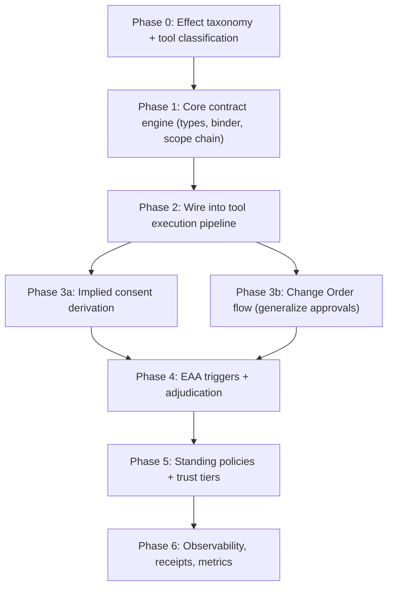

# Consent-Bound Agency via Scope-as-Contract in OpenClaw

## Conceptual Mapping: Paper to OpenClaw

The paper defines five core primitives. Here is how each maps to OpenClaw's existing architecture:

| Paper Concept                      | OpenClaw Existing Surface                                                           | Integration Point                                                                               |
| ---------------------------------- | ----------------------------------------------------------------------------------- | ----------------------------------------------------------------------------------------------- |
| **Purchase Order (PO)**            | Request context (session, sender, channel, message)                                 | Formalize in `src/consent/types.ts`; derived from intake in `pi-embedded-runner/run/attempt.ts` |
| **Work Order (WO)**                | No direct equivalent (tool-policy is static filtering, not per-slice contracts)     | New artifact carried via AsyncLocalStorage (`src/consent/scope-chain.ts`)                       |
| **Change Order (CO)**              | Exec approvals + plugin approvals (`src/gateway/server-methods/plugin-approval.ts`) | Generalize approval manager into consent elicitation                                            |
| **Elevated Action Analysis (EAA)** | Partial: `tools.elevated`, dangerous-tools list, system prompt safety section       | New deliberation module (`src/consent/eaa.ts`)                                                  |
| **Standing Policies**              | Tool profiles, allow/deny lists, owner-only, group policies                         | Extend with bounding-box metadata in `src/consent/policy.ts`                                    |

---

## Phase 0: Effect Class Taxonomy and Tool Classification

Before any runtime enforcement, define the vocabulary of effects and classify every tool.

### 0a. Define the Effect Class Enum

Create `src/consent/types.ts` with the foundational types:

```typescript
export type EffectClass =
  | "read" // read-only data access
  | "compose" // internal content creation (drafts, plans)
  | "persist" // durable state write (memory, files)
  | "disclose" // external communication / third-party disclosure
  | "audience-expand" // adding recipients or broadening reach
  | "irreversible" // deletion, revocation, actions that cannot be undone
  | "exec" // host/system command execution
  | "network" // outbound network requests
  | "elevated" // administrative or privileged operations
  | "physical"; // physical actuation (future: robotics)
```

### 0b. Effect Profiles on Tools

Extend `AnyAgentTool` (`[src/agents/tools/common.ts](src/agents/tools/common.ts)`) with an optional `effectProfile`:

```typescript
export type ToolEffectProfile = {
  effects: EffectClass[];
  trustTier?: "in-process" | "sandboxed" | "external";
  description?: string; // human-legible effect summary
};
```

### 0c. Classify Existing Tools

Build a registry mapping in `src/consent/effect-registry.ts` that maps known tool names to their declared `EffectClass[]`. This is the deterministic lookup table the binder will use:

- `read`, `glob`, `grep`, `ls` --> `["read"]`
- `write`, `apply_patch`, `notebook_edit` --> `["persist"]`
- `exec`, `bash` --> `["exec", "irreversible"]`
- `web_fetch`, `web_search` --> `["network", "read"]`
- `message_send` --> `["disclose"]`
- `memory_*` --> `["persist"]`
- `delete` --> `["irreversible", "persist"]`

Plugin-registered tools declare their own profiles via `registerTool` options.

---

## Phase 1: Core Contract Engine

### 1a. Work Order Type

In `src/consent/types.ts`, define the WO as an immutable, serializable artifact:

```typescript
export type WorkOrder = {
  id: string; // unique WO id (uuid)
  predecessorId?: string; // for WO' chains
  requestContextId: string; // links to PO
  grantedEffects: EffectClass[]; // what this slice may cause
  constraints: WOConstraint[]; // limits (time-bound, audience, etc.)
  stepRef?: string; // tool/skill identity for ceiling check
  consentAnchors: ConsentAnchor[]; // refs to consent records or EAA adjudications
  mintedAt: number; // timestamp
  expiresAt?: number; // TTL
  immutable: true; // marker
};
```

### 1b. Purchase Order (Request Context)

Formalize the request context that already flows through the agent run:

```typescript
export type PurchaseOrder = {
  id: string;
  requestText: string;
  senderId: string;
  senderIsOwner: boolean;
  channel?: string;
  chatType?: string;
  sessionKey?: string;
  agentId?: string;
  impliedEffects: EffectClass[]; // derived from request analysis
  timestamp: number;
};
```

The `impliedEffects` derivation is the key inference step -- see Phase 3.

### 1c. Deterministic Contract Binder

Create `src/consent/binder.ts`. The binder is the sole authority for minting WOs:

- **Inputs**: PO, active policies, consent records, EAA adjudication results, step metadata (tool effect profile)
- **Outputs**: A minted WO with grants that are the intersection of (consented effects) and (step ceiling from effect profile)
- **Rules**:
  - Never accept raw capability strings from inference
  - Verify consent anchors exist and are valid before granting effects
  - Apply system policy prohibitions unconditionally
  - Bound grants to the step's declared effect profile (ceiling check)
  - Apply TTL and constraints

### 1d. Scope Chain (AsyncLocalStorage)

Create `src/consent/scope-chain.ts`, modeled on the existing `gateway-request-scope.ts` pattern:

```typescript
const consentScope = new AsyncLocalStorage<ConsentScopeState>();

export type ConsentScopeState = {
  po: PurchaseOrder;
  activeWO: WorkOrder;
  woChain: WorkOrder[]; // immutable predecessors
  consentRecords: ConsentRecord[];
  eaaRecords: EAARecord[];
};
```

This scope is created at agent run start and carried through tool execution.

---

## Phase 2: Integration with Tool Execution Pipeline

### 2a. WO Minting at Agent Run Start

In `[src/agents/pi-embedded-runner/run/attempt.ts](src/agents/pi-embedded-runner/run/attempt.ts)`, after the PO is derived from the incoming message context, mint an initial WO covering implied-consent effects. The binder uses the tool set and request text to derive the initial grants.

### 2b. Before-Tool-Call WO Verification

In `[src/agents/pi-tools.before-tool-call.ts](src/agents/pi-tools.before-tool-call.ts)`, add a verification step:

1. Look up the tool's `EffectProfile` from the registry
2. Read the active WO from `ConsentScopeState`
3. Verify that every effect in the tool's profile is covered by the WO's `grantedEffects`
4. If not covered: **fail closed** -- return a structured refusal to the orchestrator
5. The orchestrator (agent loop) can then: requalify (mint WO'), request explicit consent (CO), invoke EAA, or refuse

### 2c. Plugin Tool Effect Profile Registration

Extend `OpenClawPluginToolOptions` in `[src/plugins/types.ts](src/plugins/types.ts)` to accept an `effectProfile`:

```typescript
export type OpenClawPluginToolOptions = {
  name?: string;
  names?: string[];
  optional?: boolean;
  effectProfile?: ToolEffectProfile; // NEW
};
```

`resolvePluginTools` in `[src/plugins/tools.ts](src/plugins/tools.ts)` propagates this to the tool metadata.

---

## Phase 3: Consent Lifecycle

### 3a. Implied Consent Derivation

Create `src/consent/implied-consent.ts`. This module analyzes the request text (using deterministic heuristics, not LLM inference) to derive the initial `impliedEffects`:

- Text-only questions --> `["read", "compose"]`
- "Write a file" / "edit" --> `["read", "compose", "persist"]`
- "Send a message" / "email" --> `["disclose"]`
- "Run this command" --> `["exec"]`
- "Delete" --> `["irreversible"]`
- "Search the web" --> `["network", "read"]`

This is conservative: the binder uses these as the starting ceiling. When the agent needs more, it must request a CO.

### 3b. Change Order (Explicit Consent) Flow

Generalize the existing `ExecApprovalManager` pattern into a consent-level approval flow:

- Create `src/consent/change-order.ts`
- Gateway methods: `consent.changeOrder.request`, `consent.changeOrder.resolve`
- Protocol schemas in `src/gateway/protocol/schema/consent.ts`
- UI surface in `ui/src/ui/views/consent-approval.ts` -- displays the CO in **effect terms** ("This will send information to external recipients. Proceed?")
- When granted, the binder mints a successor WO (WO') with the expanded grants
- When denied, the agent must replan within the current WO or refuse

### 3c. Consent Record Persistence

Create `src/consent/consent-store.ts`:

- Consent records stored per-session at `~/.openclaw/agents/<agentId>/consent/`
- Each record: `{ id, poId, woId, effectClasses, decision, timestamp, expiresAt }`
- Used by the binder to verify consent anchors
- Queryable for audit and explainability

### 3d. Revocation and Withdrawal

- **Requestor revocation**: user sends a revocation command; the system invalidates active WOs and stops future work dependent on revoked terms
- **Agent withdrawal**: when constraints change or duties conflict, the agent can withdraw commitment and explain why
- Wire into the existing `/cancel` and session reset flows

---

## Phase 4: Elevated Action Analysis (EAA)

### 4a. EAA Trigger Detection

Create `src/consent/eaa-triggers.ts`. EAA is triggered when:

- Standing/role is ambiguous (sender not owner, channel is group, etc.)
- Effect boundary is underspecified (request is vague: "handle this")
- Duty collision detected (e.g., delete request vs. evidence preservation)
- Tool has `trustTier: "external"` and involves `disclose` or `irreversible` effects
- Tool is in `DANGEROUS_ACP_TOOL_NAMES` (already flagged in `[src/security/dangerous-tools.ts](src/security/dangerous-tools.ts)`)

### 4b. EAA Adjudication Loop

Create `src/consent/eaa.ts`:

1. **Classify** action and affected parties
2. **Discovery** -- gather minimal context needed
3. **Evaluate** standing, risk, duties
4. **Select** least invasive sufficient action
5. **Outcome**: `proceed | request-consent | constrained-comply | emergency-act | refuse | escalate`
6. **Produce artifacts**: `EAAAdjudicationResult` (formal, to binder) + `EAAReasoningRecord` (opaque, for audit)

The adjudication result feeds into the binder as a consent anchor. The binder verifies it and mints a WO accordingly.

### 4c. Integration with System Prompt

Update `[src/agents/system-prompt.ts](src/agents/system-prompt.ts)` to include consent-bound agency instructions:

- Explain effect classes the agent should reason about
- Instruct the agent to identify when effects cross boundaries
- Provide the CO request mechanism (structured tool output)
- Describe when to invoke EAA (slow down and deliberate)

---

## Phase 5: Standing Policies and Extensibility

### 5a. Standing Policies with Bounding Boxes

Create `src/consent/policy.ts`:

```typescript
export type StandingPolicy = {
  id: string;
  class: "user" | "self-minted" | "system";
  effectScope: EffectClass[];
  applicability: PolicyPredicate; // channel, chatType, time, etc.
  escalationRules: EscalationRule[];
  expiry?: { maxUses?: number; expiresAt?: number };
  revocationSemantics: "immediate" | "after-current-slice";
  provenance: { author: string; createdAt: number; confirmedAt?: number };
};
```

Integrate into config at `tools.consent.policies` or per-agent `agents.<id>.consent.policies`.

### 5b. Policy Application Order

In the binder, apply policies in precedence order:

1. System policies (inviolable)
2. Standing/consent checks
3. EAA triggers (override user policies when high-stakes)
4. User and confirmed policies (reduce friction)

### 5c. Dynamic Skill Trust Tiers

Extend plugin manifest and tool registration to declare `trustTier`:

- `in-process` -- runs within the agent's enforcement boundary
- `sandboxed` -- runs in a constrained environment
- `external` -- out-of-band, external service

The binder applies stricter consent requirements for lower-trust tiers.

---

## Phase 6: Observability and Accountability

### 6a. Scope Chain Event Model

Create `src/consent/events.ts` with structured events:

- `wo.minted`, `wo.expired`, `wo.superseded`
- `co.requested`, `co.granted`, `co.denied`
- `eaa.started`, `eaa.completed`
- `effect.executed` (with effect class tags)
- `consent.revoked`, `consent.withdrawn`
- `breach.detected`, `breach.contained`, `breach.remediated`

Emit via the existing gateway event broadcast system.

### 6b. Action Receipts

When a task completes, generate a receipt:

- What was done (high-level actions)
- What effects occurred (effect classes)
- What consent was relied on
- What constraints applied
- What errors occurred

Available at three detail levels: **confirmation** (routine), **receipt** (non-routine), **report** (high-stakes/breach).

### 6c. Gateway Protocol Extensions

Add to `[src/gateway/protocol/schema/](src/gateway/protocol/schema/)`:

- `consent.ts` -- WO, CO, consent record, EAA record schemas
- New gateway methods: `consent.wo.current`, `consent.chain.query`, `consent.co.request`, `consent.co.resolve`, `consent.revoke`
- Operator scope: `operator.consent` for consent management methods

### 6d. Metrics

Track and expose:

- CO rate by effect class, grant/deny rates
- EAA invocation rate and outcome distribution
- WO verification failures (should be near zero in steady state)
- Breach rate and time-to-containment

---

## Implementation Sequencing (Recommended Rollout)



Phases 0-2 are foundational and sequential. Phase 3a and 3b can proceed in parallel. Phases 4-6 build on the foundation.

---

## Key Files Created/Modified

**New files** (all under `src/consent/`):

- `types.ts` -- EffectClass, WorkOrder, PurchaseOrder, ChangeOrder, ConsentRecord, EAARecord, StandingPolicy
- `binder.ts` -- Deterministic contract binder (sole WO minter)
- `scope-chain.ts` -- AsyncLocalStorage-based consent scope
- `effect-registry.ts` -- Tool-to-effect-class mapping table
- `implied-consent.ts` -- Request analysis for implied effects
- `change-order.ts` -- CO request/resolve flow
- `consent-store.ts` -- Consent record persistence
- `eaa.ts` -- Elevated Action Analysis engine
- `eaa-triggers.ts` -- EAA trigger detection
- `policy.ts` -- Standing policies with bounding boxes
- `events.ts` -- Scope chain event model
- `remediation.ts` -- Breach containment + remediation protocol

**Modified files**:

- `[src/agents/tools/common.ts](src/agents/tools/common.ts)` -- Add `effectProfile` to `AnyAgentTool`
- `[src/agents/pi-tools.before-tool-call.ts](src/agents/pi-tools.before-tool-call.ts)` -- WO verification before execution
- `[src/agents/pi-embedded-runner/run/attempt.ts](src/agents/pi-embedded-runner/run/attempt.ts)` -- PO derivation + initial WO minting
- `[src/agents/system-prompt.ts](src/agents/system-prompt.ts)` -- Consent-bound agency instructions
- `[src/plugins/types.ts](src/plugins/types.ts)` -- `effectProfile` in `OpenClawPluginToolOptions`
- `[src/plugins/tools.ts](src/plugins/tools.ts)` -- Propagate effect profiles
- `[src/gateway/protocol/schema.ts](src/gateway/protocol/schema.ts)` -- Export consent schemas
- `[src/gateway/method-scopes.ts](src/gateway/method-scopes.ts)` -- Add `operator.consent` scope
- `[src/config/types.tools.ts](src/config/types.tools.ts)` -- Consent configuration surface

---

## Design Constraints

- **No breaking changes** to existing plugin SDK -- `effectProfile` is optional and additive
- **Fail-open initially** -- Phase 2 verification logs warnings before enforcing (configurable `consent.enforcement: "log" | "warn" | "enforce"`)
- **Deterministic binder only** -- The binder is pure TypeScript with no LLM calls; inference is advisory only
- **Backward compatible** -- Tools without declared effect profiles get a conservative default classification from the registry
- **Phased rollout** -- Each phase is independently testable and deployable
